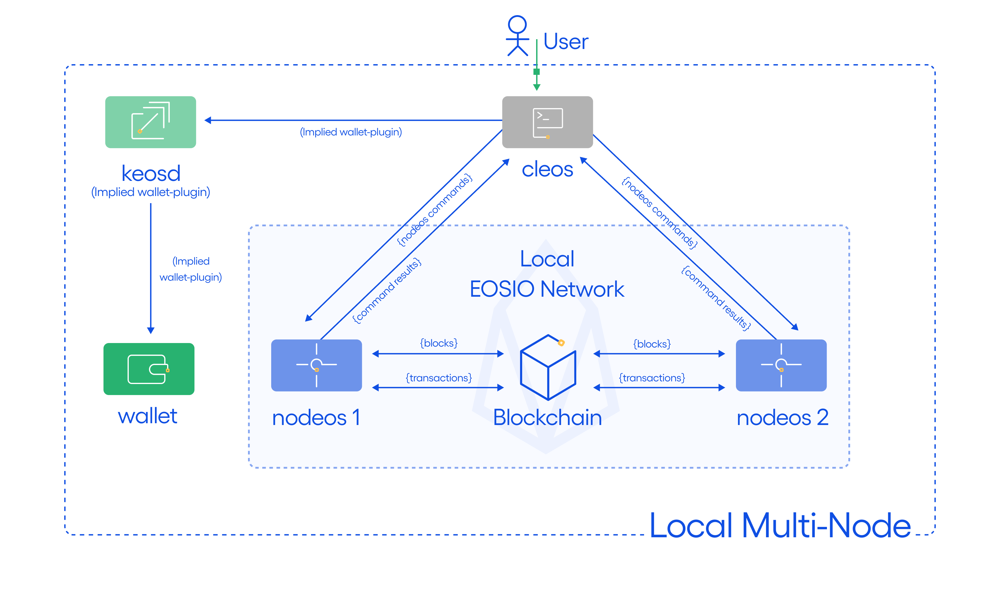

## Goal

This section describes how to set up a multi-node blockchain configuration running on a single host.  This is referred to as a _**single host, multi-node testnet**_.  We will set up two nodes on your local computer and have them communicate with each other.  The examples in this section rely on three command-line applications, `nodeos`, `keosd`, and `cleos`.  The following diagram depicts the desired testnet configuration.



## Before you begin

* [Install the EOSIO software](../../../00_install/index.md) before starting this section.
* It is assumed that `nodeos`, `cleos`, and `keosd` are accessible through the path. If you built EOSIO using shell scripts, make sure to run the [Install Script](../../../00_install/01_build-from-source/01_shell-scripts/03_install-eosio-binaries.md).
* Know how to pass [Nodeos options](../../02_usage/00_nodeos-options.md) to enable or disable functionality.

## Steps

Open four "terminal" windows and perform the following steps:

1. [Start the Wallet Manager](#1-start-the-wallet-manager)
2. [Create a Default Wallet](#2-create-a-default-wallet)
3. [Loading the EOSIO Key](#3-loading-the-eosio-key)
4. [Start the First Producer Node](#4-start-the-first-producer-node)
5. [Start the Second Producer Node](#5-start-the-second-producer-node)
6. [Get Nodes Info](#6-get-nodes-info)

### 1. Start the Wallet Manager

In the first terminal window, start `keosd`, the wallet management application:

```sh
$ keosd --http-server-address 127.0.0.1:8899
```

If successful, `keosd` will display some information, starting with:

```console
2493323ms thread-0   wallet_plugin.cpp:39          plugin_initialize    ] initializing wallet plugin
2493323ms thread-0   http_plugin.cpp:141           plugin_initialize    ] host: 127.0.0.1 port: 8899
2493323ms thread-0   http_plugin.cpp:144           plugin_initialize    ] configured http to listen on 127.0.0.1:8899
2493323ms thread-0   http_plugin.cpp:213           plugin_startup       ] start listening for http requests
2493324ms thread-0   wallet_api_plugin.cpp:70      plugin_startup       ] starting wallet_api_plugin
```

Look for a line saying the wallet is listening on 127.0.0.1:8899. This will indicate that `keosd` started correctly and is listening on the correct port. If you see anything else, or you see some error report prior to "starting wallet_api_plugin", then you need to diagnose the issue and restart.

When `keosd` is running correctly, leave that window open with the wallet app running and move to the next terminal window.

### 2. Create a Default Wallet

In the next terminal window, use `cleos`, the command-line utility, to create the default wallet.

```sh
$ cleos --wallet-url http://127.0.0.1:8899  wallet create --to-console
```

`cleos` will indicate that it created the "default" wallet, and will provide a password for future wallet access. As the message says, be sure to preserve this password for future use. Here is an example of this output:

```console
Creating wallet: default
Save password to use in the future to unlock this wallet.
Without password imported keys will not be retrievable.
"PW5JsmfYz2wrdUEotTzBamUCAunAA8TeRZGT57Ce6PkvM12tre8Sm"
```

`keosd` will generate some status output in its window. We will continue to use this second window for subsequent `cleos` commands.

### 3. Loading the EOSIO Key

The private blockchain launched in the steps above is created with a default initial key which must be loaded into the wallet.

```sh
$ cleos --wallet-url http://127.0.0.1:8899 wallet import --private-key 5KQwrPbwdL6PhXujxW37FSSQZ1JiwsST4cqQzDeyXtP79zkvFD3
```

```console
imported private key for: EOS6MRyAjQq8ud7hVNYcfnVPJqcVpscN5So8BhtHuGYqET5GDW5CV
```

### 4. Start the First Producer Node

We can now start the first producer node. In the third terminal window run:

```sh
$ nodeos --enable-stale-production --producer-name eosio --plugin eosio::chain_api_plugin --plugin eosio::net_api_plugin
```

This creates a special producer, known as the "bios" producer. Assuming everything has executed correctly to this point, you should see output from the `nodeos` process reporting block creation.

### 5. Start the Second Producer Node

The following commands assume that you are running this tutorial from the `eos\build` directory, from which you ran `./eosio_build.sh` to build the EOSIO binaries.

To start additional nodes, you must first load the `eosio.bios` contract. This contract enables you to have direct control over the resource allocation of other accounts and to access other privileged API calls. Return to the second terminal window and run the following command to load the contract:

```sh
$ cleos --wallet-url http://127.0.0.1:8899 set contract eosio build/contracts/eosio.bios
```

We will create an account to become a producer, using the account name `inita`.  To create the account, we need to generate keys to associate with the account, and import those into our wallet.

Run the create key command:

```sh
$ cleos create key
```

[[caution | Caution]]
| The command line instructions that follow use the private/public keys shown below. In order to be able to cut-and-paste the command line instructions directly from this tutorial, use those keys instead of the ones generated from your `cleos create key` command. If you still want to use your newly generated keys, you need to replace the key values with yours in the commands that follow.

This will report newly generated public and private keypairs that will look similar to the following.

```console
Private key: 5JgbL2ZnoEAhTudReWH1RnMuQS6DBeLZt4ucV6t8aymVEuYg7sr
Public key: EOS6hMjoWRF2L8x9YpeqtUEcsDKAyxSuM1APicxgRU1E3oyV5sDEg
```

Now import the private key portion into your wallet. If successful, the matching public key will be reported. This should match the previously generated public key:

```sh
$ cleos --wallet-url http://127.0.0.1:8899 wallet import 5JgbL2ZnoEAhTudReWH1RnMuQS6DBeLZt4ucV6t8aymVEuYg7sr
```

```console
imported private key for: EOS6hMjoWRF2L8x9YpeqtUEcsDKAyxSuM1APicxgRU1E3oyV5sDEg
```

Create the `inita` account that we will use to become a producer. The `create account` command requires two public keys, one for the account's owner key and one for its active key.  In this example, the newly created public key is used twice, as both the owner key and the active key. Example output from the create command is shown:

```sh
$ cleos --wallet-url http://127.0.0.1:8899 create account eosio inita EOS6hMjoWRF2L8x9YpeqtUEcsDKAyxSuM1APicxgRU1E3oyV5sDEg EOS6hMjoWRF2L8x9YpeqtUEcsDKAyxSuM1APicxgRU1E3oyV5sDEg
```

```console
executed transaction: d1ea511977803d2d88f46deb554f5b6cce355b9cc3174bec0da45fc16fe9d5f3  352 bytes  102400 cycles
#         eosio <= eosio::newaccount            {"creator":"eosio","name":"inita","owner":{"threshold":1,"keys":[{"key":"EOS6hMjoWRF2L8x9YpeqtUEcsDK...
```

We now have an account that is available to have a contract assigned to it, enabling it to do meaningful work. In other tutorials, the account has been used to establish simple contracts. In this case, the account will be designated as a block producer.

In the fourth terminal window, start a second `nodeos` instance. Notice that this command line is substantially longer than the one we used above to create the first producer. This is necessary to avoid collisions with the first `nodeos` instance. Fortunately, you can just cut and paste this command line and adjust the keys:

```sh
$ nodeos --producer-name inita --plugin eosio::chain_api_plugin --plugin eosio::net_api_plugin --http-server-address 127.0.0.1:8889 --p2p-listen-endpoint 127.0.0.1:9877 --p2p-peer-address 127.0.0.1:9876 --config-dir node2 --data-dir node2 --private-key [\"EOS6hMjoWRF2L8x9YpeqtUEcsDKAyxSuM1APicxgRU1E3oyV5sDEg\",\"5JgbL2ZnoEAhTudReWH1RnMuQS6DBeLZt4ucV6t8aymVEuYg7sr\"]
```

The output from this new node will show a little activity but will stop reporting until the last step in this tutorial, when the `inita` account is registered as a producer account and activated. Here is some example output from a newly started node. Your output might look a little different, depending on how much time you took entering each of these commands. Furthermore, this example is only the last few lines of output:

```console
2393147ms thread-0   producer_plugin.cpp:176       plugin_startup       ] producer plugin:  plugin_startup() end
2393157ms thread-0   net_plugin.cpp:1271           start_sync           ] Catching up with chain, our last req is 0, theirs is 8249 peer dhcp15.ociweb.com:9876 - 295f5fd
2393158ms thread-0   chain_controller.cpp:1402     validate_block_heade ] head_block_time 2018-03-01T12:00:00.000, next_block 2018-04-05T22:31:08.500, block_interval 500
2393158ms thread-0   chain_controller.cpp:1404     validate_block_heade ] Did not produce block within block_interval 500ms, took 3061868500ms)
2393512ms thread-0   producer_plugin.cpp:241       block_production_loo ] Not producing block because production is disabled until we receive a recent block (see: --enable-stale-production)
2395680ms thread-0   net_plugin.cpp:1385           recv_notice          ] sync_manager got last irreversible block notice
2395680ms thread-0   net_plugin.cpp:1271           start_sync           ] Catching up with chain, our last req is 8248, theirs is 8255 peer dhcp15.ociweb.com:9876 - 295f5fd
2396002ms thread-0   producer_plugin.cpp:226       block_production_loo ] Previous result occurred 5 times
2396002ms thread-0   producer_plugin.cpp:244       block_production_loo ] Not producing block because it isn't my turn, its eosio
```

At this point, the second `nodeos` is an idle producer. To turn it into an active producer, `inita` needs to be registered as a producer with the bios node, and the bios node needs to perform an action to update the producer schedule.

```sh
$ cleos --wallet-url http://127.0.0.1:8899 push action eosio setprods "{ \"schedule\": [{\"producer_name\": \"inita\",\"block_signing_key\": \"EOS6hMjoWRF2L8x9YpeqtUEcsDKAyxSuM1APicxgRU1E3oyV5sDEg\"}]}" -p eosio@active
```

```console
executed transaction: 2cff4d96814752aefaf9908a7650e867dab74af02253ae7d34672abb9c58235a  272 bytes  105472 cycles
#         eosio <= eosio::setprods              {"version":1,"producers":[{"producer_name":"inita","block_signing_key":"EOS6hMjoWRF2L8x9YpeqtUEcsDKA...
```

Congratulations, you have now configured a two-node testnet! You can see that the original node is no longer producing blocks but it is receiving them. You can verify this by running the `get info` commmand against each node.

### 6. Get Nodes Info

Get info about the first node:

```sh
$ cleos get info
```

This should produce output that looks similar to this:

```console
{
  "server_version": "223565e8",
  "head_block_num": 11412,
  "last_irreversible_block_num": 11411,
  "head_block_id": "00002c94daf7dff456cd940bd585c4d9b38e520e356d295d3531144329c8b6c3",
  "head_block_time": "2018-04-06T00:06:14",
  "head_block_producer": "inita"
}
```

Now for the second node:

```sh
$ cleos --url http://127.0.0.1:8889 get info
```

This should produce output that looks similar to this:

```console
{
  "server_version": "223565e8",
  "head_block_num": 11438,
  "last_irreversible_block_num": 11437,
  "head_block_id": "00002cae32697444fa9a2964e4db85b5e8fd4c8b51529a0c13e38587c1bf3c6f",
  "head_block_time": "2018-04-06T00:06:27",
  "head_block_producer": "inita"
}
```

In a later tutorial we will explore how to use more advanced tools to run a multi-host, multi-node testnet.
