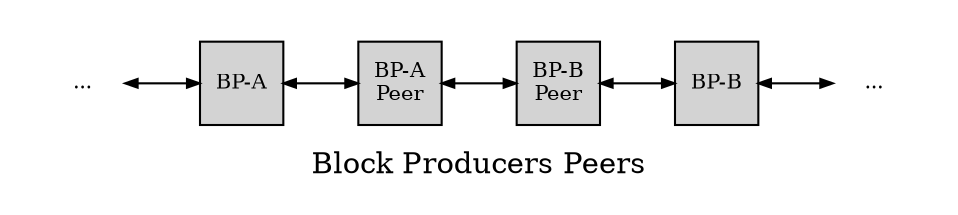

For simplicity of the explanation let's consider the following notations:

m = max_block_cpu_usage

t = block-time

e = last-block-cpu-effort-percent

w = block_time_interval = 500ms

a = produce-block-early-amount = (w - w*e/100) ms

p = produce-block-time; p = t - a

c = billed_cpu_in_block = minimum(m, w - a)

n = network tcp/ip latency

peer validation for similar hardware/eosio-version/config will be <= m

**Let's consider for exemplification the following four BPs and their network topology as depicted in below diagram**

`BP-A` will send block at `p` and,

`BP-B` needs block at time `t` or otherwise will drop it.

If `BP-A`is producing 12 blocks as follows `b(lock) at t(ime) 1`, `bt 1.5`, `bt 2`, `bt 2.5`, `bt 3`, `bt 3.5`, `bt 4`, `bt 4.5`, `bt 5`, `bt 5.5`, `bt 6`, `bt 6.5` then `BP-B` needs `bt 6.5` by time `6.5` so it has `.5` to produce `bt 7`.

Please notice that the time of `bt 7` minus `.5` equals the time of `bt 6.5` therefore time `t` is the last block time of `BP-A` and when `BP-B` needs to start its first block.

## Example 1
`BP-A` has 50% e, m = 200ms, c = 200ms, n = 0ms, a = 250ms:
`BP-A` sends at (t-250ms) <-> `BP-A-Peer` processes for 200ms and sends at (t - 50ms) <-> `BP-B-Peer` processes for 200ms and sends at (t + 150ms) <-> arrive at `BP-B` 150ms too late.

## Example 2
`BP-A` has 40% e and m = 200ms, c = 200ms, n = 0ms, a = 300ms:
(t-300ms) <-> (+200ms) <-> (+200ms) <-> arrive at `BP-B` 100ms too late.

## Example 3
`BP-A` has 30% e and m = 200ms, c = 150ms, n = 0ms, a = 350ms:
(t-350ms) <-> (+150ms) <-> (+150ms) <-> arrive at `BP-B` with 50ms to spare.

## Example 4
`BP-A` has 25% e and m = 200ms, c = 125ms, n = 0ms, a = 375ms:
(t-375ms) <-> (+125ms) <-> (+125ms) <-> arrive at `BP-B` with 125ms to spare.

## Example 5
`BP-A` has 10% e and m = 200ms, c = 50ms, n = 0ms, a = 450ms:
(t-450ms) <-> (+50ms) <-> (+50ms) <-> arrive at `BP-B` with 350ms to spare.

## Example 6
`BP-A` has 10% e and m = 200ms, c = 50ms, n = 15ms, a = 450ms:
(t-450ms) <- +15ms -> (+50ms) <- +15ms -> (+50ms) <- +15ms -> `BP-B` <-> arrive with 305ms to spare.

## Example 7
Example world-wide network:`BP-A`has 10% e and m = 200ms, c = 50ms, n = 15ms/250ms, a = 450ms:
(t-450ms) <- +15ms -> (+50ms) <- +250ms -> (+50ms) <- +15ms -> `BP-B` <-> arrive with 70ms to spare.

Running wasm-runtime=eos-vm-jit eos-vm-oc-enable on relay node will reduce the validation time.
