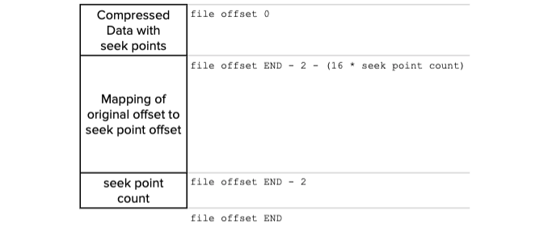

## Overview

The `trace_api_plugin` provides a consumer-focused long-term API for retrieving retired actions and related metadata from a specified block. The plugin stores serialized block trace data to the filesystem for later retrieval via HTTP RPC requests. For detailed information about the definition of this application programming interface see the [Trace API reference](api-reference/index.md).

## Purpose

While integrating applications such as block explorers and exchanges with an EOSIO blockchain, the user might require a complete transcript of actions processed by the blockchain, including those spawned from the execution of smart contracts and scheduled transactions. The `trace_api_plugin` serves this need. The purpose of the plugin is to provide:

* A transcript of retired actions and related metadata
* A consumer-focused long-term API to retrieve blocks
* Maintainable resource commitments at the EOSIO nodes

Therefore, one crucial goal of the `trace_api_plugin` is to improve the maintenance of node resources (file system, disk space, memory used, etc.). This goal is different from the existing `history_plugin` which provides far more configurable filtering and querying capabilities, or the existing `state_history_plugin` which provides a binary streaming interface to access structural chain data, action data, as well as state deltas.

## Usage

```console
# config.ini
plugin = eosio::trace_api_plugin
[options]
```
```sh
# command-line
nodeos ... --plugin eosio::trace_api_plugin [options]
```

## Configuration Options

These can be specified from both the `nodeos` command-line or the `config.ini` file:

```console
Config Options for eosio::trace_api_plugin:

  --trace-dir arg (="traces")           the location of the trace directory 
                                        (absolute path or relative to 
                                        application data dir)
  --trace-slice-stride arg (=10000)     the number of blocks each "slice" of 
                                        trace data will contain on the 
                                        filesystem
  --trace-minimum-irreversible-history-blocks arg (=-1)
                                        Number of blocks to ensure are kept 
                                        past LIB for retrieval before "slice" 
                                        files can be automatically removed.
                                        A value of -1 indicates that automatic 
                                        removal of "slice" files will be turned
                                        off.
  --trace-minimum-uncompressed-irreversible-history-blocks arg (=-1)
                                        Number of blocks to ensure are 
                                        uncompressed past LIB. Compressed 
                                        "slice" files are still accessible but 
                                        may carry a performance loss on 
                                        retrieval
                                        A value of -1 indicates that automatic 
                                        compression of "slice" files will be 
                                        turned off.
  --trace-rpc-abi arg                   ABIs used when decoding trace RPC 
                                        responses.
                                        There must be at least one ABI 
                                        specified OR the flag trace-no-abis 
                                        must be used.
                                        ABIs are specified as "Key=Value" pairs
                                        in the form <account-name>=<abi-def>
                                        Where <abi-def> can be:
                                           an absolute path to a file 
                                        containing a valid JSON-encoded ABI
                                           a relative path from `data-dir` to a
                                        file containing a valid JSON-encoded 
                                        ABI
                                        
  --trace-no-abis                       Use to indicate that the RPC responses 
                                        will not use ABIs.
                                        Failure to specify this option when 
                                        there are no trace-rpc-abi 
                                        configuations will result in an Error.
                                        This option is mutually exclusive with 
                                        trace-rpc-api
```

## Dependencies

* [`chain_plugin`](../chain_plugin/index.md)
* [`http_plugin`](../http_plugin/index.md)

### Load Dependency Examples

The following plugins are loaded with default settings if not specified on the command line or `config.ini`:

```console
# config.ini
plugin = eosio::chain_plugin
[options]
plugin = eosio::http_plugin 
[options]
```
```sh
# command-line
nodeos ... --plugin eosio::chain_plugin [options]  \
           --plugin eosio::http_plugin [options]
```

## Configuration Example

Here is a `nodeos` configuration example for the `trace_api_plugin` when tracing some EOSIO reference contracts:

```sh
nodeos --data-dir data_dir --config-dir config_dir --trace-dir traces_dir
--plugin eosio::trace_api_plugin 
--trace-rpc-abi=eosio=abis/eosio.abi 
--trace-rpc-abi=eosio.token=abis/eosio.token.abi 
--trace-rpc-abi=eosio.msig=abis/eosio.msig.abi 
--trace-rpc-abi=eosio.wrap=abis/eosio.wrap.abi
```

## Definitions

This section provides an overview of *slices*, the *trace log* contents, and the *clog format*. Mastery of these concepts is beneficial for an effective use of the `trace_api_plugin` options.

### Slices

In the context of the `trace_api_plugin`, a *slice* is defined as a collection of all relevant trace data between a given starting block height (inclusive) and a given ending block height (exclusive). For instance, a slice from 0 to 10,000 is a collection of all blocks with block numbers greater than or equal to 0 and less than 10,000. The trace directory contains a collection of slices. Each slice consists of a *trace data* log file and a *trace index* metadata log file:

  *  `trace_<S>-<E>.log`
  *  `trace_index_<S>-<E>.log`

where `<S>` and `<E>` are the starting and ending block numbers for the slice padded with leading 0's to a stride. For instance if the start block is 5, the last is 15, and the stride is 10, then the resulting `<S>` is `0000000005` and `<E>` is `0000000015`.

#### trace_&lt;S&gt;-&lt;E&gt;.log

The trace data log is an append only log that stores the actual binary serialized block data. The contents include the transaction and action trace data needed to service the RPC requests augmented by the per-action ABIs. Two block types are supported:
  
  * `block_trace_v0`
  * `block_trace_v1`

The data log begins with a basic header that includes versioning information about the data stored in the log. `block_trace_v0` includes the block ID, block number, previous block ID, the production timestamp, the producer that signed the block, and the actual trace data. `block_trace_v1` adds both merkle root hashes for the list of transactions and the list of actions included in the block as well as the production schedule count since genesis.

The log may include blocks that have been forked out of the blockchain as part of the normal operations of the chain. The next entry in the file will always have a block number one higher than the previous one or the same number or less because of forking.  Every trace entry will have a corresponding entry in the corresponding slice file for trace indexes. Note that forked blocks can be avoided by running nodeos in `read-mode=irreversible`.

#### trace_index&#95;&lt;S&gt;-&lt;E&gt;.log

The trace index log or metadata log is an append only log that stores a sequence of binary-serialized types. Currently two types are supported:

  * `block_entry_v0`
  * `lib_entry_v0`

The index log begins with a basic header that includes versioning information about the data stored in the log. `block_entry_v0` includes the block ID and block number with an offset to the location of that block within the data log. This entry is used to locate the offsets of both `block_trace_v0` and `block_trace_v1` blocks. `lib_entry_v0` includes an entry for the latest known LIB. The reader module uses the LIB information for reporting to users an irreversible status.

### clog format

Compressed trace log files have the `.clog` file extension (see [Compression of log files](#compression-of-log-files) below). The clog is a generic compressed file with an index of seek-able decompression points appended at the end. The clog format layout looks as follows:



The data is compressed into raw zlib form with full-flush *seek points* placed at regular intervals. A decompressor can start from any of these *seek points* without reading previous data and it can also traverse a seek point without issue if it appears within the data.

[[info | Size reduction of trace logs]]
| Data compression can reduce the space growth of trace logs twentyfold! For instance, with 512 seek points and using the test dataset on the EOS public network, data compression reduces the growth of the trace directory from &#126;50 GiB/day to &#126;2.5 GiB/day for full data. Due to the high redundancy of the trace log contents, the compression is still comparable to `gzip -9`. The decompressed data is also made immediately available via the [Trace RPC API](api-reference/index.md) without any service degradation.

#### Role of seek points

As the file is being compressed, the seek point index records the original uncompressed offset with the new compressed offset creating a mapping so that the original index values (uncompressed offsets) can be mapped to the nearest seek point before the uncompressed offset. This dramatically reduces the seek time to parts of the uncompressed file that appear later in the stream.

## Automatic Maintenance

One of the main design goals of the `trace_api_plugin` is to minimize the manual housekeeping and maintenance of filesystem resources. To that end, the plugin facilitates the automatic removal of trace log files and the automatic reduction of their disk footprint through data compression.

### Removal of log files

To allow the removal of previous trace log files created by the `trace_api_plugin`, you can use the following option: 

```sh
  --trace-minimum-irreversible-history-blocks N (=-1) 
```

If the argument `N` is 0 or greater, the plugin will only keep `N` blocks on disk before the current LIB block. Any trace log file with block numbers lesser than then previous `N` blocks will be scheduled for automatic removal.

### Compression of log files

The `trace_api_plugin` also supports an option to optimize disk space by applying data compression on the trace log files:

```sh
  --trace-minimum-uncompressed-irreversible-history-blocks N (=-1)
```

If the argument `N` is 0 or greater, the plugin automatically sets a background thread to compress the irreversible sections of the trace log files. The previous N irreversible blocks past the current LIB block are left uncompressed.

[[info | Trace API utility]]
| The trace log files can also be compressed manually with the [trace_api_util](../../../10_utilities/trace_api_util.md) utility.

If resource usage cannot be effectively managed via the `trace-minimum-irreversible-history-blocks` and `trace-minimum-uncompressed-irreversible-history-blocks` options, then there might be a need for periodic manual maintenance. In that case, the user may opt to manage resources through an external system or recurrent process.

## Manual Maintenance

The `trace-dir` option defines the directory on the filesystem where the trace log files are stored by the `trace_api_plugin`. These files are stable once the LIB block has progressed past a given slice and then can be deleted at any time to reclaim filesystem space. The deployed EOSIO system will tolerate any out-of-process management system that removes some or all of these files in this directory regardless of what data they represent, or whether there is a running `nodeos` instance accessing them or not.  Data which would nominally be available, but is no longer so due to manual maintenance, will result in a HTTP 404 response from the appropriate API endpoint(s).

[[info | For node operators]]
| Node operators can take full control over the lifetime of the historical data available in their nodes via the `trace-api-plugin` and the `trace-minimum-irreversible-history-blocks` and `trace-minimum-uncompressed-irreversible-history-blocks` options in conjunction with any external filesystem resource manager.
