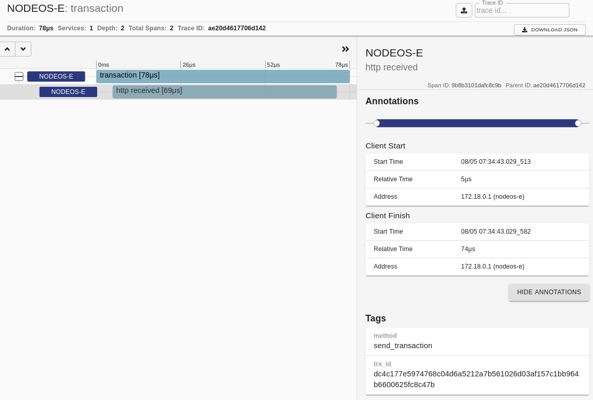

## Overview

The `Zipkin service` is a [distributed tracing system](https://zipkin.io/). It helps gather timing data needed to troubleshoot latency problems in service architectures. Its features include both the collection and lookup of this data. `Zipkin tracer` is the EOSIO component that sends traces to the `Zipkin service`. The `Zipkin` service can be installed in the local environment or it can be remote.

### How To Enable Zipkin Tracer

EOSIO makes available `Zipkin tracer` through the [core `chain_plugin`](https://developers.eos.io/manuals/eos/v2.0/nodeos/plugins/chain_plugin/index/?query=chain%20plugin&page=1#gatsby-focus-wrapper). To enable the `Zipkin tracer` you must set the `telemetry-url` parameter for the `chain_plugin`. There are two additional parameters you can set: `telemetry-service-name` and `telemetry-timeout-us`. All three available parameters are detailed below:

* `telemetry-url` specifies the url of the Zipkin service, e.g. [http://127.0.0.1:9411/api/v2/spans](http://127.0.0.1:9411/api/v2/spans) if it is installed in the local environment.
* `telemetry-service-name` specifies the Zipkin `localEndpoint.serviceName` sent with each span.
* `telemetry-timeout-us`, optional parameter, specifies the timeout for sending zipkin spans with default value set to 200000. `Zipkin tracer` sends zipkin spans, in json format, to the `Zipkin service` via HTTP POST requests on a separate thread. `telemetry-timeout-us` specifies how long to allow each HTTP POST request before reaching the time out and thus fail. Nine consecutive failures will disable the `Zipkin tracer` until a restart of `nodeos` daemon occurs.

Once `Zipkin tracer` is enabled you can observe the detailed traces it sends to the `Zipkin service`. Examples of such traces are given below.

Submitted transaction:

Processed transaction:

Block accepted:

SHiP Accepted:

