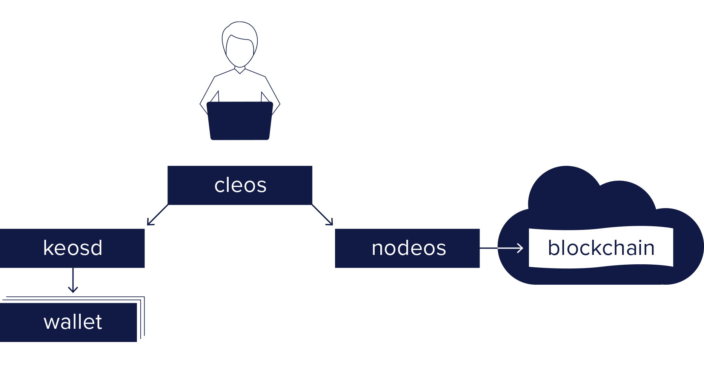

# Nodeos Overview

EOSIO comes with a number of programs.  The primary ones that you will use, and the ones that are covered here, are:

* `nodeos` (node + eos = nodeos)  - the core EOSIO node daemon that can be configured with plugins to run a node. Example uses are block production, dedicated API endpoints, and local development. 
* `cleos` (cli + eos = cleos) - command line interface to interact with the blockchain and to manage wallets.
* `keosd` (key + eos = keosd) - component that securely stores EOSIO keys in wallets. 

The basic relationship between these components is illustrated in the following diagram.

Please navigate the sections below to build the EOSIO components, deploy them in various network configurations, and learn how to use them for supporting EOSIO blockchain applications.

* [Install](01_install/index.md) - Installing EOSIO and dependencies; build from source, etc.
* [Usage](02_usage/index.md) - Using `nodeos`, config options, node setups/environments.
* [Plugins](03_plugins/index.md) - Using plugins, plugin options, mandatory vs. optional.
* [Replays](04_replays/index.md) - Replaying the chain from a snapshot or a blocks.log file.
* [Logging](06_logging/index.md) - Logging config/usage, loggers, appenders, logging levels.
* [Upgrade Guides](07_upgrade-guides/index.md) - EOSIO version/consensus upgrade guides.
* [Troubleshooting](08_troubleshooting/index.md) - common `nodeos` troubleshooting questions.

[[info | Access Node]]
| A local or remote EOSIO access node running `nodeos` is required for a client application or smart contract to interact with the blockchain.
