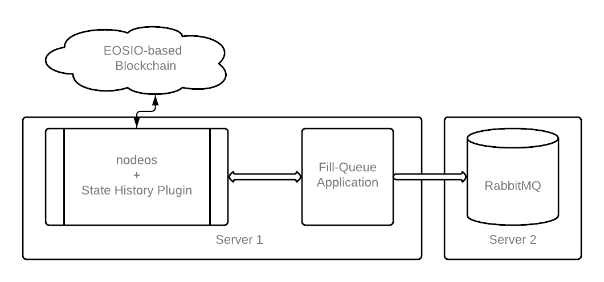

## What is Fill-Queue

Fill-Queue is an application which accomplishes the following:

1. connects to a state-history enabled `EOSIO` node,
2. reads the blocks,
3. filters the desired contracts’ actions and
4. uses the [AMQ protocol](https://www.amqp.org/) to push messages to a configured queue.

## Overview

Fill-Queue is an application derived from [history-tools](https://developers.eos.io/welcome/v2.1/tools/history-tools/history-tools/). It has to be configured to connect to a state-history enabled `EOSIO` node, from which it reads the blocks, filters the desired contracts’ actions and publishes messages to a queue. Fill-Queue uses Advanced Message Queuing Protocol (AMQP) to connect to Message Queue. So far Fill-Queue was tested with RabbitMQ only.

To build and install the Fill-Queue application please follow the instructions outlined in the [How-To Setup And User Fill-Queue](./fill-queue-how-to).

## SHiP plug-in

The Fill-Queue application depends on the SHiP plug-in for its data source. The data provided by the SHiP plug-in is transited and/or stored in a more widespread, more commonly used protocol, namely AMQP, the Advanced Message Queuing Protocol. Thus it can be viewed as an application that complements the existing SHiP plug-in.

## Performance considerations

There are no important performance considerations for Fill-Queue application. Because it is a protocol adapter it uses relatively low memory and it does not use excessively the CPU time. Its throughput is strictly limited by how fast `nodeos`, with SHiP enabled, can send data to it, and that is the only potential bottleneck.

A healthy sync state-history enabled node running Fill-Queue application should be filling a queue with a rate of 2 messages per second, because there are two blocks per second produced by an EOSIO-based blockchain.

Fill-Queue application tolerates low hardware configurations at runtime. Any machine that can build it in a reasonable, satisfactory, amount of time can also run it without problems.  \
The RabbitMQ hosting needs attention because depending on how long it is running it can require significant amounts of storage for saving the accumulating message, therefore this aspect has to be considered carefully.

## Common Architecture



In this example the `nodeos` and the Fill-Queue application are deployed on the same server instance and the RabbitMQ is deployed on a separate server instance. But you can choose to deploy and run them all on the same server or have them deployed on separate servers. The optimal architecture will have to take in consideration the following:

* The load of the messages filtered.
* The server configurations used.
* The deployment scheme where the `nodeos` + SHiP + Fill-Queue application + RabbitMQ will have to be fit into, if one already exists.

## Configuration Parameters Settings

Fill-Queue application supports the following configurable parameters in its `config.ini` file:

* `fill-connect-to`: nodeos state-history address
* `filtered-actions`: contracts/actions to filter in your published messages transaction trace, the possible values are
    * `contract:` to filter all the actions of the contract
    * `contract:action` to filter only the specified `action` of the `contract`
    * `ps`: all deltas belonging to `contract` will be sent, even if it listens for a single action that has nothing to do with that delta trace
* `queue-address`: sets the AMQ server address eg `localhost:5672` (RabbitMQ default)
* `queue-name`: sets the name of the queue that will be filled
* `full-log`: prints the full published messages in the logs
* `fill-skip-to &lt;block_num>`: fill-queue will skip to a certain block MAKE SURE that you have the proper ABI in the data folder with the correct prior block number (`contract-1234.abi`), or skip to a block number where the `setabi` was executed right after, otherwise it can cause deserialization problems of actions/deltas since the ABI will be different than the one expected by the chain.
* `fill-stop &lt;block_num>`: will stop fill-queue when it reaches the specified block

## Filters

Filters determine what messages the Fill-Queue application pushes to the queue. Filters can be defined in the `config.ini` file. 

### Filter all actions for a contract

To filter all the actions of a specific smart contract, set the `filtered-actions` configuration property to the name of the contract.

For example to filter all the actions for the `eosio.token` contract set the configuration file to contain the following line:

```text
filtered-actions = eosio.token:
```

### Filter one action for a contract

To filter only one action of a smart contract, add a ``filtered-actions`` configuration property and set its value to be the name of the contract followed by a column `:` and the name of the action.

For example to filter only the action `transfer` for `eosio.token` contract set the configuration file to contain the following line:

```text
filtered-actions = eosio.token:transfer
```

### Filter random actions from different contracts

To filter random actions, belonging to different contracts, add a `filtered-actions` property in the configuration file for every `contract:action` pair.

For example to filter

* `transfer`, `issue` and `create` actions for `eosio.token` contract
* and `setacctnet`, `setacctcpu` and `setacctram` for `eosio.system` contract

place the following lines in the configuration file:

```text
filtered-actions = eosio.token:transfer
filtered-actions = eosio.token:issue
filtered-actions = eosio.token:create
filtered-actions = eosio.system:setacctnet
filtered-actions = eosio.system:setacctcpu
filtered-actions = eosio.system:setacctram
```

### Filter all actions for all contracts

To bypass the filtering altogether, that is, to have no filter and push all actions for all contracts, use the asterisks ‘*’ as the value for `filtered-actions`.

```text
filtered-actions = *
```

Be aware that this configuration can fill up the memory quickly and it could stop `nodeos`. If you use this configuration the `Fill-Queue` will also print a warning message at the console, see below for details:

```console
info  2021-03-11T11:14:27.871 thread-0  fill_queue_config.hpp:84      load                 ] --filter-on * enabled. This can fill shared_mem, causing nodeos to stop.
```
