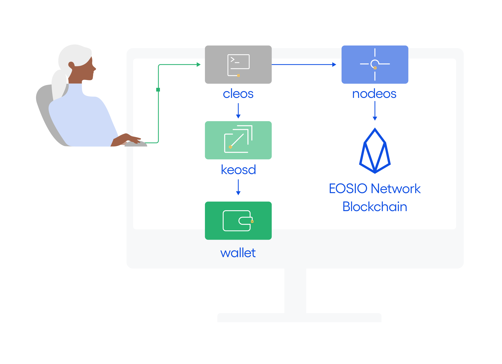

# EOSIO Overview

EOSIO is a configurable blockchain platform for deploying smart contracts and distributed applications. EOSIO comes with a number of programs. The primary ones that you will use are the following:

* [`nodeos`](01_nodeos/index.md) (node + eos = nodeos)  - core service daemon that runs a node for block production, API endpoints, or local development.
* [`cleos`](02_cleos/index.md) (cli + eos = cleos) - command line interface to interact with the blockchain (via `nodeos`) and manage wallets (via `keosd`).
* [`keosd`](03_keosd/index.md) (key + eos = keosd) - component that manages EOSIO keys in wallets and provides a secure enclave for digital signing.

The basic relationship between these components is illustrated in the following diagram.

[[info | What's Next?]]
| [Install the EOSIO Software](00_install/index.md) before proceeding to the sections above.
