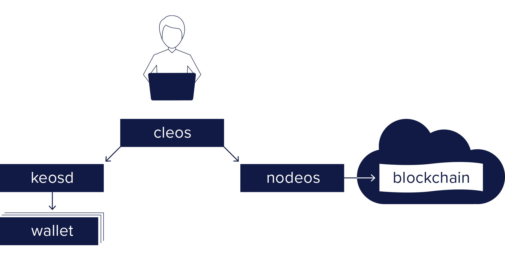

# EOSIO Overview

EOSIO is the next-generation blockchain platform for creating and deploying smart contracts and distributed applications. EOSIO comes with a number of programs. The primary ones included in EOSIO are the following:

* [Nodapifiny](01_nodapifiny/index.md) (node + apifiny = nodapifiny)  - core service daemon that runs a node for block production, API endpoints, or local development.
* [Clapifiny](02_clapifiny/index.md) (cli + apifiny = clapifiny) - command line interface to interact with the blockchain (via `nodapifiny`) and manage wallets (via `kapifinyd`).
* [Kapifinyd](03_kapifinyd/index.md) (key + apifiny = kapifinyd) - component that manages EOSIO keys in wallets and provides a secure enclave for digital signing.

The basic relationship between these components is illustrated in the diagram below.

[[info | What's Next?]]
| [Install the EOSIO Software](00_install/index.md) before exploring the sections above.
