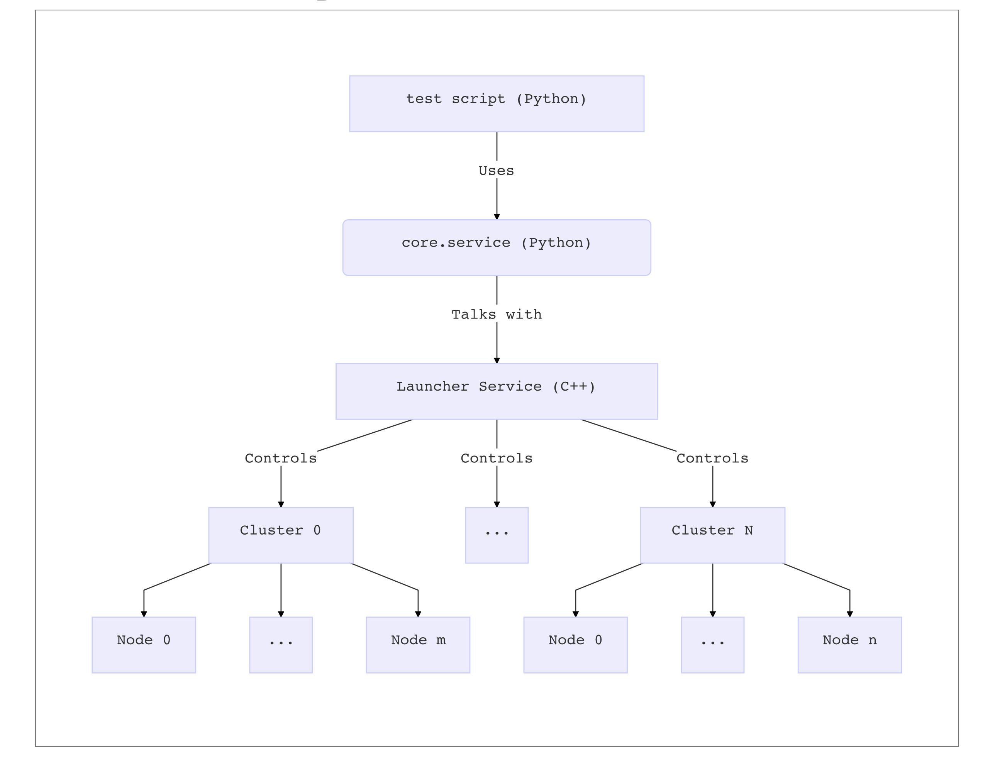
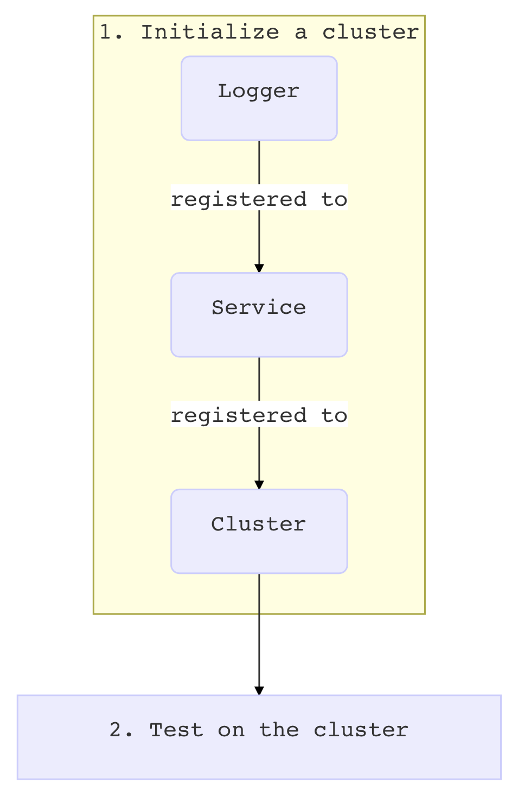

# Launcher Service-based EOSIO Testing Framework

  * [What is It](#what-is-it)
     * [Features](#features)
     * [Architecture](#architecture)
  * [Getting Started](#getting-started)
     * [High-Level](#high-level)
     * [A Real Example](#a-real-example)
        * [The Context Manager](#the-context-manager)
  * [Configuration](#configuration)
     * [Hierarchy](#hierarchy)
     * [Ask for Help](#ask-for-help)
     * [Logger](#logger)
        * [A Quick Example](#a-quick-example)
        * [Writer Settings](#writer-settings)
           * [More about Buffering](#more-about-buffering)
        * [Log Levels](#log-levels)
     * [Service](#service)
     * [Cluster](#cluster)
  * [Testing](#testing)
     * [Mechanism](#mechanism)
     * [Main API](#main-api)
     * [**call_kwargs](#call_kwargs)
  * [Debugging](#debugging)
  * [Troubleshooting](#troubleshooting)

## What is It

The Launcher Service-based EOSIO Testing Framework aims to provide a more manageable, deterministic and independent nodeos testing environment to replace the original Python testing framework.

### Features

- **Fully-Customizable**

  With the Launcher Service, it is now possible to

  - specify the numbers of nodes & producers, the network topology, among a variety of parameters for a cluster of nodes, either from the test script or via the command-line arguments;
  - set up specific options for an individual node in a cluster;
  - query the entire cluster state with a single API (*useful when checking if all the nodes are in sync, and the head block number that they sync at*);
  - query a particular node's information, including the node's port number, process ID, log data, etc;
  - shut down or restart one or all the nodes in a cluster, with clean-up work done automatically;
  - send specific signals (e.g. `SIGTERM`, `SIGKILL`) to a particular node;
  - activate any protocol features.

- **Parallel**

  Allow multiple test cases to run simultaneously without interfering with each other.

  - Each test case runs on a separate cluster of nodes, with a unique cluster ID that can be specified by `cluster_id` in the test script or by `-i`  or `--cluster-id` from the command line.
  - Port assignment is managed by the Launcher Service.
  - Log files are properly placed / automatically renamed based on the cluster ID.
  - Support up to 30 clusters by default.

- **Self-Contained**

  - Independent from `cleos`
    - Able to push arbitrary actions to arbitrary nodes from the Launcher Service.
  - Independent from `keosd`
    - Key management and key-signing done automatically by the Launcher Service.
    - Able to import keys, to generate keys from a random seed, and to select the right keys to sign any transaction.
  - Transaction Verification
    - Able to verify any transaction given transaction ID, without resorting to `history_plugin`.


### Architecture



## Getting Started

### High-Level

At a high level, a typical Python test script has only two steps:

1. Initialize a cluster
2. Test on the cluster

In order to initialize a cluster, three sub-steps are needed:

(1) create a `Logger` object

(2) create a `Service` object, and register the `Logger` to it

(3) create a `Cluster` object, and register the `Service` to it



The `Logger`, `Service` and `Cluster` objects respectively control the logging behavior, the Launcher Service, and a particular cluster of nodes.

### A Real Example

The following code is an excerpt from a real test script. The three sub-steps for the cluster initialization are bundled in a `init_cluster()` function. This exemplifies a typical way to start a test script.

```python
from core.logger import ScreenWriter, FileWriter, Logger
from core.service import Service, Cluster, BlockchainError, SyncError


def init_cluster():
    test = "fork"
    logger = Logger(ScreenWriter(threshold="info"),
                    FileWriter(filename=f"{test}-info.log", threshold="info", monochrome=True),
                    FileWriter(filename=f"{test}-debug.log", threshold="debug", monochrome=True),
                    FileWriter(filename=f"{test}-trace.log", threshold="trace", monochrome=True))
    service = Service(logger=logger)
    cluster = Cluster(service=service, node_count=3, pnode_count=3, producer_count=7,
                      topology="bridge", center_node_id=1, dont_setprod=True,
                      special_log_levels=[["net_plugin_impl", "debug"]])
    return cluster


def main():
    with init_cluster() as clus:
        testname = "Fork Test"
        clus.print_begin(testname)
        # carry out test (e.g. set contract, push actions) via clus
        clus.print_end(testname)


if __name__ == "__main__":
    main()
```

The imports bring into scope related classes. Note that `Logger` resides in `core.logger`, while `Service` and `Cluster` reside in `core.service`. `BlockchainError` and `SyncError` represent `RuntimeError` types that are specifically related to the blockchain logic. In particular, `SyncError` inherits from the `BlockchainError` and represents the in-sync status of nodes.

A `Logger` object has full control over the logging behavior throughout the test. It is created by specifying where to log, and what to log. In this case, the `Logger` has 4 logging destinations: printing to the screen, plus writing to three log files, at different log levels.

A `Service` object should know the `Logger` and all the settings regarding the Launcher Service. In this example, everything is set to default. Normally, it is safe to do so. If there already is a Launcher Service program running in the background, the `Service` object will be able to detect it, and will automatically connect to it by default.

A `Cluster` object should know the `Service` and all the settings regarding the cluster of nodes. In this example, the settings include:

1. `node_count=3` : there are 3 nodes in the cluster
2. `pnode_count=3` : the 3 nodes all have producers
3. `producer_count=7` : there are 7 producers in the cluster
4. `topology="bridge"` : the network topology is `bridge`
5. `center_node_id=1` : node 1 is the center node for the `bridge` topology
6. `dont_setprod=True` : do not automatically set producers (using `setprods`) after launch

The first three settings together suggest that the node mapping will be 3 producer accounts in node 0, and 2 producer accounts each in nodes 1 and 2.

Node 1 is going to be the connecting node for the `bridge` network topology.

After the launch of the cluster, the producer accounts will be created using `newaccount`, but they will *not* be set as producers using `setprods`. This is because there will be a customized producer-setting process in the body of testing.

#### The Context Manager

It is highly recommended to use a context manger for a `Cluster` object, i.e. to use the `with` statement as in the example.

```python
with init_cluster() as clus:
```

With the context manager, it is guaranteed that if the program crashes, say because of an unexpected `RuntimeError`, all the buffered information will be flushed.

## Configuration

The `Logger`,  `Service` and `Cluster` objects are all configured at their creation.

### Hierarchy

Configuration in general comes from 3 sources, with the later items, if specified, overriding the earlier items as shown in the list below:

1. default values, which can be overridden by
2. in-script arguments, which can be overridden by
3. command-line arguments

For example, the default value for a cluster ID is 0

```python
DEFAULT_CLUSTER_ID = 0
```

which can be overridden in the script when creating a cluster

```python
cluster = Cluster(service=service, cluster_id=2)
```

which can be again overridden from the command line. When running the test script, the user may require that the cluster be launched with cluster ID 6, by specifying

```bash
./script.py --cluster-id 6
```

or simply

```bash
./script.py -i 6
```

*The purpose of the design is to allow flexibility in the testing. It allows users to temporarily change the testing behavior without modifying the script. For example, if the user passes `--debug` at the command line, the logger will print out all the logging information at or above `debug` level, regardless of the original threshold for the log level.*

### Ask for Help

For command-line configuration, passing `-h` or `--help` will list all the settings. Below is a list of the settings.

```
  Launcher Service-based EOSIO Testing Framework

  -h, --help                     Show this message and exit

  ----- Service Settings ------------------------------------------------------
  -a IP, --addr IP               IP address of launcher service
  -o PORT, --port PORT           Listening port of launcher service
  -w PATH, --wdir PATH           Working directory
  -f PATH, --file PATH           Path to executable file of launcher service
  -g PATH, --gene PATH           Path to genesis file
  -s, --start                    Always start a new launcher service
  -k, --kill                     Kill existing launcher services (if any)
  --extra-service-args ARGS      Extra arguments to pass to launcher service

  ----- Cluster Settings ------------------------------------------------------
  -c PATH, --cdir PATH           Smart contracts directory
  -i ID, --cluster-id ID         Cluster ID to launch with
  -n NUM, --node-count NUM       Number of nodes
  -p NUM, --pnode-count NUM      Number of nodes with producers
  -q NUM, --producer-count NUM   Number of producers
  -u NUM, --unstarted-count NUM  Number of unstarted nodes
  -t SHAPE, --topology SHAPE     Cluster topology to launch with
  -r ID, --center-node-id ID     Center node ID (for bridge or star topology)
  --extra-args ARGS              Extra arguments to pass to nodeos
  --extra-configs CONFIGS        Extra configs to pass to nodeos
  --dont-newacco                 Do not create accounts after launch
  --dont-setprod                 Do not set producers after launch
  --http-retry NUM               HTTP connection: max num of retries
  --http-sleep TIME              HTTP connection: sleep time between retries
  -v, --verify-async             Verify transaction: verify asynchronously
  --verify-retry NUM             Verify transaction: max num of retries
  --verify-sleep TIME            Verify transaction: sleep time between retries
  --sync-retry NUM               Check sync: max num of retries
  --sync-sleep TIME              Check sync: sleep time between retries

  ----- Logger Settings -------------------------------------------------------
  -l LEVEL, --log-level LEVEL    Stdout logging level (numeric)
  --all                          Set stdout logging level to ALL (0)
  --trace                        Set stdout logging level to TRACE (10)
  --debug                        Set stdout logging level to DEBUG (20)
  --info                         Set stdout logging level to INFO (30)
  --warn                         Set stdout logging level to WARN (40)
  --error                        Set stdout logging level to ERROR (50)
  --fatal                        Set stdout logging level to FATAL (60)
  --flag                         Set stdout logging level to FLAG (90)
  --off                          Set stdout logging level to OFF (100)
  -m, --monochrome               Do not print in colors for stdout logging
  --dont-buffer                  Do not buffer for stdout logging
  --dont-rename                  Do not rename log files by cluster ID
  --hide-clock-time              Hide clock time in stdout logging
  --hide-elapsed-time            Hide elapsed time in stdout logging
  --hide-filename                Hide filename in stdout logging
  --hide-lineno                  Hide line number in stdout logging
  --hide-function                Hide function name in stdout logging
  --hide-thread                  Hide thread name in stdout logging
  --hide-log-level               Hide log level in stdout logging
  --hide-all                     Hide all the above in stdout logging
```

### `Logger`

A `Logger` is a composite of one or more writers, which typically include one `ScreenWriter` and several `FileWriter` objects. One writer corresponds to one logging destination. A `ScreenWriter` writes to the screen (`stdout`) while a `FileWriter` writes to a file whose name is given by `filename`.

#### A Quick Example

Given a `Logger` object

```python
logger = Logger(ScreenWriter(threshold="info"),
                FileWriter(threshold="debug", filename="debug.log"),
                FileWriter(threshold="trace", filename="trace.log"))
```

Suppose it has been registered to a `Cluster` object, whose name is `clus`. Then a line in the Python test script

```python
clus.log("Some debug information.", level="debug")
```

or equivalently

```python
clus.debug("Some debug information.")
```

will write down a line

```
Some debug information.
```

in the files `debug.log` and `trace.log`, because the log level of this line, which is `DEBUG`, is at or above the thresholds of the log files.

However, this line will not show up on the screen, because `DEBUG` is lower than `INFO`, the threshold of the `ScreenWriter`.


#### Writer Settings

In general, for a writer, the settings include

1. `threshold` : Information at or above the `threshold` will be written to the logging destination.
2. `monochrome` : If `True`, remove all the style and color codes (e.g. `\033[1;31m` for bold red) when writing the text to the logging destination. Default value is `False`.
3. `buffered` : If `True`, it will be *possible* to buffer the logging information and flush it in a coordinated manner. This is helpful when there are multiple threads running simultaneously. Default value is `True`.
4. `show_clock_time` : Show clock time in each line. Default value is `True`.
5. `show_elapsed_time` : Show elapsed time in each line. Default value is `True`.
6. `show_filename` : Show the name of the file that invokes the logging. Default value is `True`.
7. `show_lineno` : Show the line number of the function that invokes the logging. Default value is `True`.
8. `show_function` : Show the name of the function that invokes the logging. Default value is `True`.
9. `show_thread` : Show the name of the thread that invokes the logging. Default value is `True`.
10. `show_log_level` : Show the log level of the line. Default value is `True`.

##### More about Buffering

Buffering only matters when there are multiple threads, for example, when creating multiple accounts in parallel, or when verifying a transaction asynchronously.

For a writer, if `buffered=True`, it will be possible to keep information organized and make the log result human-readable. If `buffered=False`, logging will take place as soon as a line is ready. Multiple threads may log in an interleaving manner, unaware of each other's existence. In general, setting `buffered=False` will *not* reduce the entire logging time, but will keep the lines in a strictly chronological order, though the information itself may not be human-readable.

Note that, `buffered=True` only provides a possibility to buffer. Buffering does not happen automatically. A line of information will only be buffered when it is explicitly told to do so.

For example, given two threads, both scheduled to execute

```python
# clus is a Cluster object
clus.log("{}: first half.".format(thread_name), level="debug", buffer=True)
clus.log("{}: second half.".format(thread_name), level="debug", buffer=True)
clus.flush()
```

or equivalently

```python
# clus is a Cluster object
clus.log("{}: first half.".format(thread_name), level="debug", buffer=True)
clus.log("{}: second half.".format(thread_name), level="debug")
```

setting `buffered=True` will guarantee that the log file will either look like

```
thread-1: first half
thread-1: second half
thread-2: first half
thread-2: second half
```

or

```
thread-2: first half
thread-2: second half
thread-1: first half
thread-1: second half
```

but will never be of the following form

```
thread-2: first half
thread-1: first half
thread-1: second half
thread-2: second half
```

#### Log Levels

| level   | value |
| ------- | ----- |
| `OFF`   | 100   |
| `FLAG`  | 90    |
| `FATAL` | 60    |
| `ERROR` | 50    |
| `WARN`  | 40    |
| `INFO`  | 30    |
| `DEBUG` | 20    |
| `TRACE` | 10    |
| `ALL`   | 0     |

The `LogLevel` class accepts either a numeric value or a case-insensitive string for the level. While there are  level names for given values, all the integers in `[0, 100]` can be valid log levels. For example,

```python
clus.log("Some warning information.", level="warn")
```

is equivalent to

```python
clus.log("Some warning information.", level=40)
```

which is equivalent to

```python
clus.warn("Some warning information.")
```

As another example,

```python
clus.log("Some information more prominent than INFO but not yet a WARN", level=35)
```

This line will be written to any logging destination with a logging threshold at or lower than 35. For example, it will be printed on screen given `ScreenWriter(threshold="info")` but will not be written to a file with `FileWriter(threshold="warn", filename="warn.log")`.

### `Service`

A `Service` object represents the connection with the Launcher Service program running in the background. Once a `Service` object is created, it will try to connect to the Launcher Service automatically.

*Currently, it is only possible to connect to a local Launcher Service.*

If there already is a Launcher Service running in the background, the `Service` object will by default connect to it without starting a new one. It is possible to override this default behavior by requesting to always start a new Launcher Service program and/or to kill all the existing Launcher Service program(s).

A detailed explanation of the parameters to initialize a `Service` object can be found in its docstring.

```
Parameters
----------
logger : Logger
    Logger object which controls logging behavior.
addr : str
    IP address of launcher service.
    Currently, only local launcher service is supported. That is, only
    default value "127.0.0.1" is supported.
port : int
    Listening port of launcher service.
    If there are multiple launcher services running in the background,
    they must have different listening ports.
    Default is 1234.
wdir : str
    Working directory.
    Default is the current working directory.
file : str
    Path to executable file of launcher service.
    Can be either absolute or relative to the working directory.
gene : str
    Path to the genesis file.
    Can be either absolute or relative to the working directory.
start : bool
    Always start a new launcher service.
    To start a new instance alongside the existing ones, make sure the
    listening ports are different. Otherwise, the new launcher service
    will issue an error and exit.
    Default is False (will not start a new one if there is an existing
    launcher service running in the background).
kill : bool
    Kill existing launcher services (if any).
    Kill all the existing launcher services running in the background
    (and freshly start a new one).
    Default is False (will not kill existing launcher services; instead
    will connect to an existing launcher service).
extra_args : str
    Extra arguments to pass to launcher service.
```

For `extra_args`, the user may refer to the help text that `programs/launcher-service/launcher-service -h` offers.

### `Cluster`

A `Cluster` object represents a cluster of nodes controlled by the Launcher Service. It is the major proxy for the test scripts to communicate with the Launcher Service. A `Cluster` object must have a `Service` object registered to it at initialization.

After configuration, the node cluster will be launched with the help of the `eosio.bios` contract.

A detailed explanation of the parameters to initialize a `Cluster` object can be found in its docstring.

```
Parameters
----------
service : Service
    Launcher service object on which the node cluster will run
cdir : str
    Smart contracts directory.
    Can be either absolute or relative to service's working directory.
cluster_id : int
    Cluster ID to launch with.
    Tests with different cluster IDs can be run in parallel.
    Valid range is [0, 30). Default is 0.
node_count : int
    Number of nodes in the cluster.
    Default is 4.
pnode_count : int
    Number of nodes with at least one producer.
    Default is 4.
producer_count : int
    Number of producers in the cluster.
    Default is 4.
unstarted_count : int
    Number of unstarted nodes.
    Default is 0.
topology : str
    Cluster topology to launch with.
    Valid choices are "mesh", "bridge", "line", "ring", "star", "tree".
    Default is "mesh".
center_node_id : int
    Center node ID (for bridge or star topology).
    If topology is bridge, center node ID cannot be 0 or last one.
    No default value.
extra_args : str
    Extra arguments to pass to nodeos via launcher service.
    e.g. "--delete-all-blocks"
    Default is "".
extra_configs : list
    Extra configs to pass to nodeos via launcher service.
    e.g. ["plugin=SOME_EXTRA_PLUGIN"]
    Default is [].
dont_newacco : bool
    Do not create accounts after launch.
    Default is False (will create producer accounts).
dont_setprod : bool
    Do not set producers after launch.
    Default is False (will set producers).
http_retry : int
    Max number of retries in HTTP connection.
    Default is 100.
http_sleep : float
    Sleep time (in seconds) between HTTP connection retries.
    Default is 0.25.
verify_async : bool
    Verify transactions asynchronously.
    Start a separate thread for transaction verification. Do not wait
    for a transaction to be verified before making next transaction.
    Default is False (will wait for verification result).
verify_retry : int
    Max number of retries in transaction verification.
    Default is 100.
verify_sleep : float
    Sleep time (in seconds) between verification retries.
    Default is 0.25.
sync_retry : int
    Max number of retries in checking if nodes are in sync.
    Default is 100.
sync_sleep : float
    Sleep time (in seconds) between check-sync retries.
    Default is 0.25.
```

For `extra_args`, the user may refer to the help text that `programs/nodeos/nodeos -h` offers.

For example, from the help text of `nodeos`

```bash
--genesis-json arg (=genesis.json)    File to read Genesis State from
```

the user may create a cluster with a specific genesis file

```python
clus = Cluster(service=serv, extra_args="--genesis-json=gene.json")
```

This specifies `gene.json` as the genesis file for the cluster, which overrides the service-level setting.

## Testing

The `Cluster` class provides a list of methods, such as `set_contract()` and `push_actions()`, which serve as building blocks for a test script to build up the testing scenario.

### Mechanism

Under the hood, a `Cluster` object communicates with the Launcher Service via HTTP connection in a request-and-response model.

Almost all the methods finally passes through the `call()`  method in the `Cluster` class. The standard steps to make a call include

```
  Steps to take to make a call
  ----------------------------
  1. print header
  2. establish HTTP connection
  3. log URL and request of connection
  4. retry connection if response not ok
  5. log response
  6. verify transaction
  7. return the result as a Connection object
```

The exact actions to take are fully customizable. Refer to `**call_kwargs` for full control.

### Main API

After the launch of a node cluster, all the test actions can be performed on it. The main API is listed below.

    Main API
    --------
    - Start up and shut down
        - launch_cluster()
        - stop_cluster()
        - start_node()
        - stop_node()
        - stop_all_nodes()
    - Queries
        - get_cluster_running_state()
        - get_cluster_info()
        - get_info()
        - get_block()
        - get_account()
        - get_protocol_features()
        - get_log()
    - Transactions
        - schedule_protocol_feature_activations()
        - set_contract()
        - push_action()
    - Check and Verify
        - verify()
        - check_sync()
        - check_production_round()
    - Miscellaneous
        - send_raw()
        - pause_node_production()
        - resume_node_production()
        - get_greylist()
        - add_greylist_accounts()
        - remove_greylist_accounts()
        - get_net_plugin_connections()
The full specification of the methods can be found in their docstrings.

### `**call_kwargs`

One special parameter that appears in almost all the methods is `**call_kwargs`, which represents all the controlling keyword arguments in the `call` method, which include

```
 retry
 sleep
 dont_raise
 verify_async
 verify_key
 verify_sleep
 verify_retry
 verify_dont_raise
 header
 level
 header_level
 url_level
 request_text_level
 retry_code_level
 retry_text_level
 response_code_level
 response_text_level
 transaction_id_level
 no_transaction_id_level
 error_level
 error_text_level
 verify_level
 verify_retry_level
 verify_error_level
 buffer
 dont_flush
```

These parameters add to the flexibility of a test script. Consider

```python
def get_cluster_info(self, **call_kwargs):
    return self.call("get_cluster_info", **call_kwargs)
```

A line in the Python test script

```python
cx = clus.get_cluster_info(retry=200, response_text_level="debug")
```

will, in getting the cluster information, change the max number of HTTP connection retries to 200 (default is `100`) and set the log level for response text at `DEBUG` (default is `TRACE`). Now in a `DEBUG`-level log file, it is possible to view the text of the HTTP response.

 ## Debugging

The `core` package provides a hassle-free debugger for quick debugging in an interactive Python environment. It is especially helpful when a cluster has already been launched. The function names are identical with the corresponding query methods in the `Cluster`, and there is no need to specify logging controls.

For example, given a node cluster already launched with cluster ID 0, the user may, for one-time debugging, in the Python interactive environment, enter

```python
>>> from core.debugger import *
```

and

```python
>>> get_cluster_info(cluster_id=0)
```

or just

```python
>>> get_cluster_info(0)
```

Then the Python interactive environment may return something like

```bash
http://127.0.0.1:1234/v1/launcher/get_cluster_info
{
    "cluster_id": 0
}
<Response [200]>
<No Transaction ID>
{
    "result": [
        [
            0,
            {
                "server_version": "3bfd1a4c",
                "chain_id": "cf057bbfb72640471fd910bcb67639c22df9f92470936cddc1ade0e2f2e7dc4f",
                "head_block_num": 44,
                "last_irreversible_block_num": 9,
                "last_irreversible_block_id": "00000009d9157aac80c23e056cfa2ee06f06ee50910f35a70be188a0eeda01e5",
                "head_block_id": "0000002c69ad9d70944ca969b63230ea69b38d5e3887c88455fcad769800ef70",
                "head_block_time": "2019-11-25T10:06:03.000",
                "head_block_producer": "defproducera",
                "virtual_block_cpu_limit": 208772,
                "virtual_block_net_limit": 1094649,
                "block_cpu_limit": 199900,
                "block_net_limit": 1048576,
                "server_version_string": "v2.0.0-develop",
                "fork_db_head_block_num": 44,
                "fork_db_head_block_id": "0000002c69ad9d70944ca969b63230ea69b38d5e3887c88455fcad769800ef70",
                "server_full_version_string": "v2.0.0-develop-3bfd1a4cd4c912f9ff524d5753b90354d32cead3-dirty"
            }
        ],
        ...
    ]
}
```

which may be useful for debugging.

## Troubleshooting

**Scenario 1**

```python
__main__.LauncherServiceError: {
    "code": 500,
    "message": "Internal Service Error",
    "error": {
        "code": 0,
        "name": "exception",
        "what": "unspecified",
        "details": [
            {
                "message": "connect: Connection refused",
                "file": "http_plugin.cpp",
                "line_number": 728,
                "method": "handle_exception"
            }
        ]
    }
}
```

**Diagnosis**

Make sure you have placed the `genesis.json` file in the proper location.

By default, you should place it in the current working directory. If you have placed it elsewhere or have named it differently, make sure the program knows it, by passing `-g` or `--gene`. For example,

```bash
$ ./test.py --gene=./gene.json
```

tells the program to look for a `gene.json` in the current working directory and use it as the genesis file.

**Scenario 2**

```python
__main__.LauncherServiceError: Address already in use
```

**Diagnosis**

You may have already had a Launcher Service program running at the given port.

Try to assign another port to the current Launcher Service by, for example,

```bash
$ ../lstests/core/service.py --start --port=1235
```

or explicitly kill the existing Launcher Service program(s)

```bash
$ ../lstests/core/service.py --kill
```

**Scenario 3**

You are experimenting with the Launcher Service. After you change its source code and build it again, the Launcher Service fails to function properly.

**Diagnosis**

The old Launcher Service may still run in the background. Run

```bash
$ ps aux | grep launcher-service
```

to examine it, and run

```bash
$ pkill launcher-service
```

to kill the existing one.

