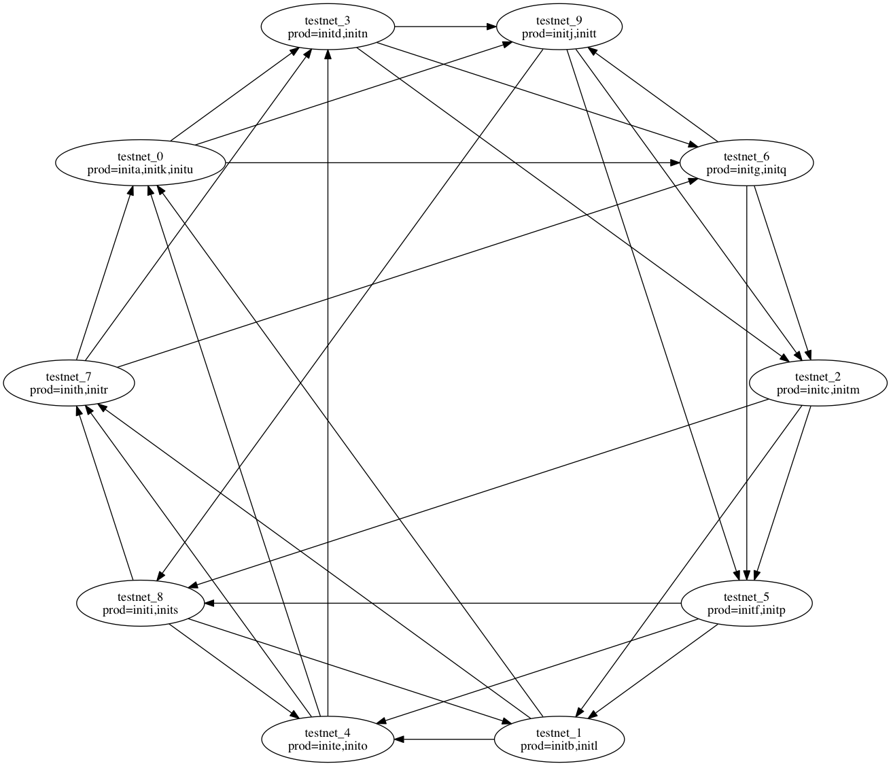
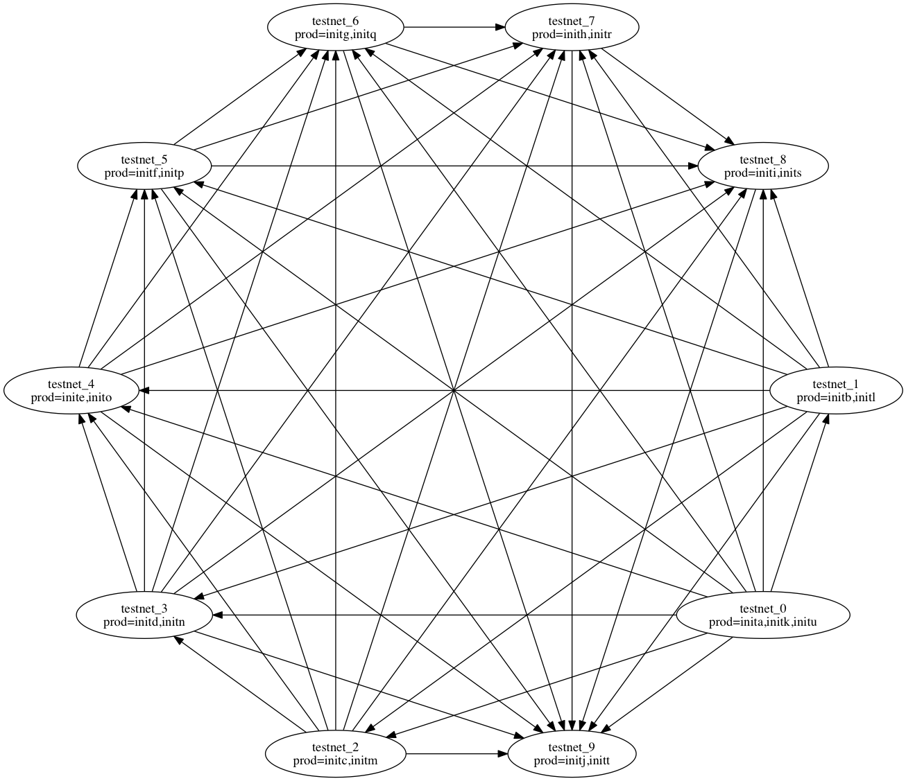

[toc]

#EOS Testnet
To date, all work done to experiment with the EOS blockchain has been performed using a single instance of eosd hosting all 21 block producers. While this is a perfectly valid solution for validating features of the blockchain, developing new contracts, or whatever, it does not scale. Nor does it expose the sort of issues raised when contract and block data must be shared across multiple instances. Providing the ability to scale involves deploying multiple eosd nodes across many hosts and lining then into a peer-to-peer (p2p) network. Composing this network involves tailoring and distributing configuration files, coordinating starts and stops and other tasks.

Doing this manually is a tedious task and easily error prone. Fortunately a solution is provided, in the form of the Launcher application, described below.

## Testnet nodes, networks, and topology
Before getting into the details of the EOS testnet, lets clarify some terms. In this document I use the terms "host" and "machine" fairly interchangeably. A host generally boils down to a single IP address, although in practice it could have more.

The next term is "node." A node is an instance of the eosd executable configured to serve as 0 or more producers. There is not a one-to-one mapping between nodes and hosts, a host may serve more than one node, but one node cannot span more than one host. 

I use "local network" to refer to any group of nodes, whether on a single host or several, are all close in that access does not have to leave a secure network environment. 

Finally there is the idea of distributed networks that involve remote hosts. These may be hosts on which you may not have direct access for starting and stopping eosd instances, but with whom you may wish to collaborate for setting up a decentralized testnet.

### Localhost networks
Running a testnet on a single machine is the quickest way to get started. As you will see below, this is the default mode for the Launcher application. You can set up a localhost network immediately by simply telling the launcher how many producing or non-producing nodes to activate, and perhaps what type of network topology to use.

The downside is that you need a lot of hardware when running many nodes on a single host. Also the multiple nodes will contend with each other in terms of CPU cycles, limiting true concurrency, and also localhost network performance is much different from inter-host performance, even with very high speed lans.

### Distributed networks
The most representative model of the live net is to spread the eosd nodes across many hosts. The Launcher app is able to start distributed nodes by the use of bash scripts pushed through ssh. In this case additional configuration is required to replace configured references to "localhost" or "127.0.0.1" with the actual host name or ip addresses of the various peer machines.

Launching a distributed testnet requires the operator to have ssh access to all the remote machines configured to authenticate without the need for a user entered password. This configuration is described in detail below. 

In cases where a testnet spans multiple remote networks, a common launcher defined configuration file may be shared externally between distributed operators, each being responsible for launching his or her own local network.

Note that the Launcher will not push instances of eosd to the remote hosts, you must prepare the various test network hosts separately.

### Network Topology
Network topology or "shape" describes how the nodes are connected in order to share transaction and block data, and requests for the same. The idea for varying network topology is that there is a trade off between the number of times a node must send a message reporting a new transaction or block, vs the number of times that message must be repeated to ensure all nodes know of it.

The Launcher has definitions of three different network "shapes" based on inter-nodal connections, which can be selected by a command line option, or you can supply your own network topology by editing the Launcher generated configuration file.

####Ring network

This is the simplest network, where each node identifies just the node next to it as it's only peer. 

####Star network

A "star" is intended to support a larger number of nodes in the testnet. In this case the number of peers connected to a node and the distribution of those nodes varies based on the number of nodes in the network.

####Mesh network

In a "mesh" network, each node is connected to as many peer nodes as possible.

#The Launcher Application
To address the complexity implied by distributing multiple eosd nodes across a LAN or a wider network, the launcher application was created. 

Based on a handful of command line arguments the Launcher is able to compose per-node configuration files, distribute these files securely amongst the peer hosts, then start up the multiple instances of eosd.

Eosd instances started this way have their output logged in individual text files. Finally the launcher application is also able to shut down some or all of the test network. 

##Running the Launcher application

The launcher program is used to configure and deploy producing and non-producing eosd nodes that talk to each other using configured routes. The configuration for each node is stored in separate directories, permitting multiple nodes to be active on the same host, assuming the machine has sufficient memory and disk space for multiple eosd instances. The launcher makes use of multiple configuration sources in order to deploy a testnet. A handful of command line arguments can be used to set up simple local networks. 

To support deploying distributed networks, the launcher will read more detailed configuration from a JSON file. You can use the launcher to create a default JSON file based on the command line options you supply. Edit that file to substitute actual hostnames and other details 
as needed, then rerun the launcher supplying this file.

For the moment the launcher only activates platform-native nodes, dockerized nodes will be added later. It should be straight forward to use the generated configuration files with dockerized nodes.

## Launcher command line arguments
Here is the current list of command line arguments recognized by the launcher.

```
Testnet launcher options:
  -n [ --nodes ] arg (=1)               total number of nodes to configure and 
                                        launch
  -p [ --pnodes ] arg (=1)              number of nodes that are producers
  -s [ --shape ] arg (=ring)            network topology, use "ring" "star" 
                                        "mesh" or give a filename for custom
  -g [ --genesis ] arg (="./genesis.json")
                                        set the path to genesis.json
  -o [ --output ] arg                   save a copy of the generated topology 
                                        in this file
  --skip-signature                      EOSD does not require transaction 
                                        signatures.
   -i [ --timestamp ] arg                set the timestamp for the first block. 
                                        Use "now" to indicate the current time
  -l [ --launch ] arg                   select a subset of nodes to launch. 
                                        Currently may be "all", "none", or 
                                        "local". If not set, the default is to 
                                        launch all unless an output file is 
                                        named, in which case it starts none.
  -k [ --kill ]                         The launcher retrieves the previously 
                                        started process ids and issue a sigterm
                                        to each.
  -h [ --help ]                         print this list
```
Note that if a testnet.json file is supplied as the `--shape` argument, then the `--nodes`, `--pnodes`, and `--genesis` arguments are all ignored.

## The testnet.json Configuration File
This is the file generated by running the launcher with the `--output` argument. The object described in this file is composed of a helper for using ssl, and a collection of testnet node descriptors. The node descriptors are listed as name, value pairs. Note that the names serve a dual purpose acting as both the key in a map of node descriptors and as an alias for the node in the peer lists. For example:

```
{
  "ssh_helper": {
    "ssh_cmd": "/usr/bin/ssh",
    "scp_cmd": "/usr/bin/scp",
    "ssh_identity": "phil",
    "ssh_args": "-i ~phil/.ssh/id-sample"
  },
```
The ssh helper fields are paths to ssh and scp, an identity if necessary, and any optional arguments. 
  
```
  "nodes": [[
      "testnet_0",{
        "genesis": "./genesis.json",
        "remote": true,
        "ssh_identity": "",
        "ssh_args": "",
        "eos_root_dir": "/home/phil/blockchain/eos",
        "data_dir": "tn_data_0",
        "hostname": "remoteserv",
        "public_name": "remoteserv",
        "p2p_port": 9876,
        "http_port": 8888,
        "filesize": 8192,
        "keys": [{
            "public_key": "EOS6MRyAjQq8ud7hVNYcfnVPJqcVpscN5So8BhtHuGYqET5GDW5CV",
            "wif_private_key": "5KQwrPbwdL6PhXujxW37FSSQZ1JiwsST4cqQzDeyXtP79zkvFD3"
          }
        ],
        "peers": [
          "testnet_1",
          "testnet_2",
          "testnet_3",
          "testnet_4",
          "testnet_5"
        ],
        "producers": [
          "inita",
          "initg",
          "initm",
          "inits"
        ]
      }
    ],[
      "testnet_1",{

```

The rest of the testnet.json file is the collection of node descriptors. The fragment shown above was created with the command line `programs/launcher/launcher -p6 -s mesh -o testnet.json` and then edited to refer to a remote host named "remoteserv."

###Elements Of The JSON File
This table describes all of the key/value pairs used in the testnet.json file.

|Value    | Description
|:------------- | :-----------
|ssh_helper | a set of values used to facilitate the use of SSH and SCP
nodes | a collection of descriptors defining the eosd instances used to assemble this testnet. The names used as keys in this collection are also aliases used within as placeholders for peer nodes.

|ssh_helper elements | Description
|:---------- | :------------
ssh_cmd | path to the local ssh command
scp_cmd | path to the local scp command
ssh_args | any additional command line arguments needed to successfully connect to remote peers
ssh_identity | The user name to use when accessing the remote hosts

|per-node elements | Description
|:-------- | :----------
genesis | path to the genesis.json file. This should be the same file for all members of the testnet.
remote | specifies whether this node is in the local network or not. This flag ties in with the launch mode command line option (-l) to determine if the local launcher instance will attempt to start this node.
ssh_identity | a per-node override of the general ssh_identity defined above.
ssh_args | a per-node override of the general ssh_args
eos_root_dir | specifies the directory into which all eosd artifacts are based. This is required for any hosts that are not the local host.
data_dir | the root for the remaining node-specific settings below.
hostname | the domain name for the server, or its IP address.
public_name | possibly different from the hostname, this name will get substituted for the aliases when creating the per-node config.ini file's peer list.
p2p_port | combined with the public name to identify the endpoint listed on for peer connections. When multiple nodes share a host, the p2p_port is automatically incremented for each node.
http_port | defines the listen endpoint for the client API services
filesize | sets the capacity in megabytes for the size of the blockchain backing store file. 
keys | specify the authentication tokens for this node.
peers | this list indicates the other nodes in the network to which this one actively connects. Since this file may be edited to alter the hostname, public name, or p2p port values, the peers list here holds aliases for the actual endpoints eventually written to the individual config.ini files.
producers | this list identifies which of the producers from the genesis.json file are held by this node. Note that the launcher uses a round-robin algorithm to spread the producer instances across the producing nodes.

###Provisioning Distributed Servers
The ssh_helper section of the testnet.json file contains the ssh elements necessary to connect and issue commands to other servers. In addition to the ssh_helper section which provides access to global configuration settings, the per-node configuration may provide overriding identity and connection arguments.

It is also necessary to provision the server by at least copying the eosd executable, and the genesis.json files to their appropriate locations relative to some named EOS root directory. For example, I defined the EOS root to be `/home/phil/blockchain/eos`. When run, the launcher will run through a variety of shell commands using ssh and finally using scp to copy a config.ini file to the appropriate data directory on the remote.

## Runtime Artifacts
The launcher app creates a separate date and configuration directory for each node instance. This directory is named `tn_data_<n>` with n ranging from 0 to the number of nodes being launched. 

| Per-Node File | Description
| :------------ | :----------
| config.ini  | The eosd configuration file.
| eosd.pid | The process ID of the running eosd instance.
| blockchain/* | The blockchain backing store
| blocks/* | The blockchain log store
| stderr.txt | The cerr output from eosd.
| stdout.txt | The cout output from eosd.

A file called "last_run.json" contains hints for a later instance of the launcher to be able to kill local and remote nodes when run with -k. 

#What Remains To Be Done

Functionality that remains to be implemented: caching signed transactions then purging them on a schedule. Sending summaries of blocks rather than whole blocks. Optimizing the routing between nodes. Failover during new node synchronization if a peer fails to respond timely enough

Also need to prepare tests that are distributed, deterministic, and repeatable.
