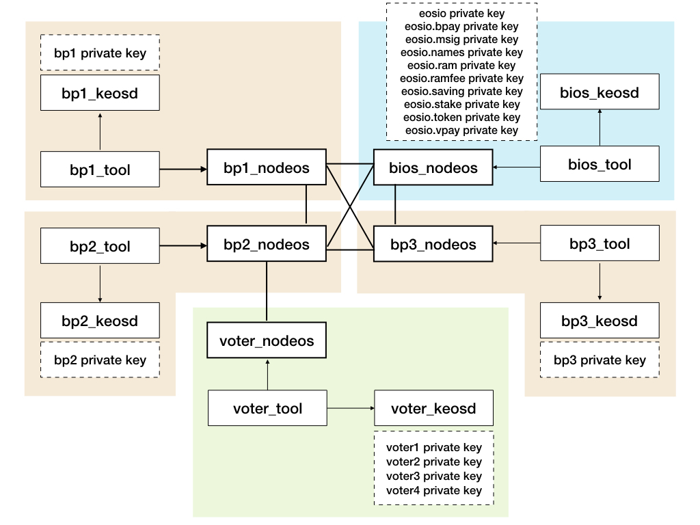

# Bios Boot Sequence Tutorial Docker Compose Implementaion 
Docker Compose를 사용하여 Bios Boot Sequence Tutorial(https://github.com/EOSIO/eos/wiki/Tutorial-Bios-Boot-Sequence) 구현

## Docker Compose Network Diagram


## Boot Sequence
1. [bios_tool] 중요한 system account들을 생성한다
```
eosio.bpay, eosio.msig, eosio.names, eosio.ram, eosio.ramfee, eosio.saving, eosio.stake, eosio.token, eosio.vpay
```
2. [bios_tool] eosio.token과 eosio.msig contract를 생성한다
3. [bios_tool] SYS 토큰을 생성하고, eosio가 1000000000.0000 SYS을 발행
3. [bios_tool] BP 계정들을 생성하고, SYS 토큰을 각 계정에 전송한다
```
bp1, bp2, bp3
```
4. [bios_tool] voting을 할 계정들을 생성하고, SYS 토큰을 각 계정에 전송한다
```
voter1, voter2, voter3, voter4
```
5. [bp1_tool] bp1 account를 BP로 등록한다.
6. [bp2_tool] bp2 account를 BP로 등록한다.
7. [bp3_tool] bp3 account를 BP로 등록한다.
8. [voter_tool] voter1 account가 bp1 bp2 bp3 에 투표
9. [voter_tool] voter2 account가 bp1 bp2 에 투표
10. [voter_tool] voter3 account가 bp1 bp2 에 투표
11. [voter_tool] voter4 account가 bp1 에 투표
12. [bios_tool] eosio가 블록을 생성하지 않고 BP들이 블록을 생성하도록 owner와 active key를 삭제
13. [bp1_tool, bp2_tool, bp3_tool] BP들은 블록 생성 후 60초가 지난 후에 첫 reward를 요청하고, 이후 24시간마다 1번씩 블록 생성에 대한 reward를 요청한다

## 처음 수행하는 경우
```bash
# datas 디렉토리를 생성한다
./init.sh
```

## 수행하는 방법
```bash
docker-compose up
```

## 재 수행하는 방법
```bash
# datas 안의 파일들을 모두 삭제하고 처음부터 다시 시작한다
./restart.sh 
```
